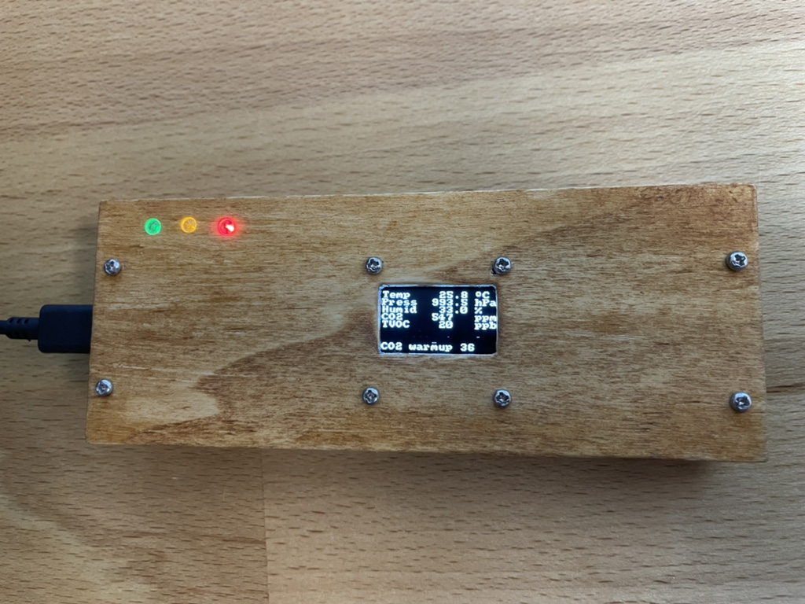
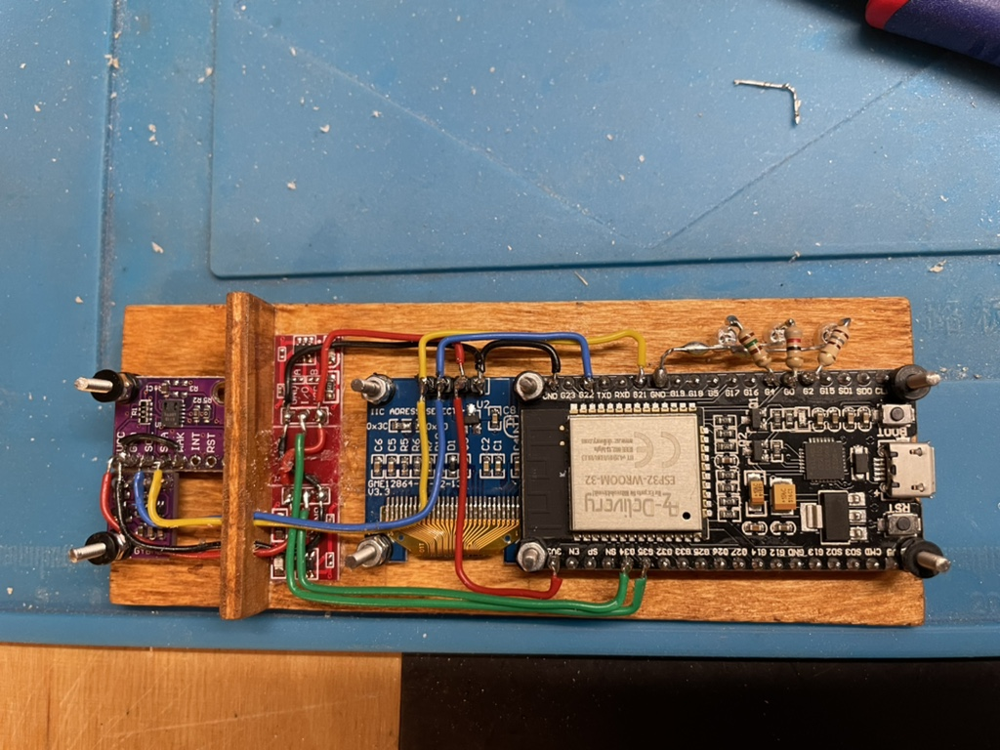

# indoor air sensor

## Hardware

Powered by ESP32. 5V through micro USB connector, all devices run on 3.3V.

Uses a bme280 for 

* temperature
* pressure
* humidity

Uses a cs811 for

* CO2
* TVOC

Uses a SSD1306 display with 128x64 pixels and the basic u8x8lib for fixed fonts.

Uses three LEDs (green, yellow, red) to show the CO2 level and need to air.

## Features

* just power on, it will display the above values and provide indication if CO2 and humidity are within range.
* toggle oled display off/on through button 1
* toggle LEDs off/on through button 2
* hold down button 1 to enter serial setup and set persitent preferences
* writes actual values to ttyUSB for long term monitoring

## Build
Load ino into the Arduino IDE and make sure the libs are around. Adafruit BME280, Adafruit CCS811 and U8g2 should be easily downloadable.

## Pictures

Prototype front

Prototype, back open

## Todo
* create Webserver and book into Wifi (needs config) to remote query the values.
* clean that code :-)
